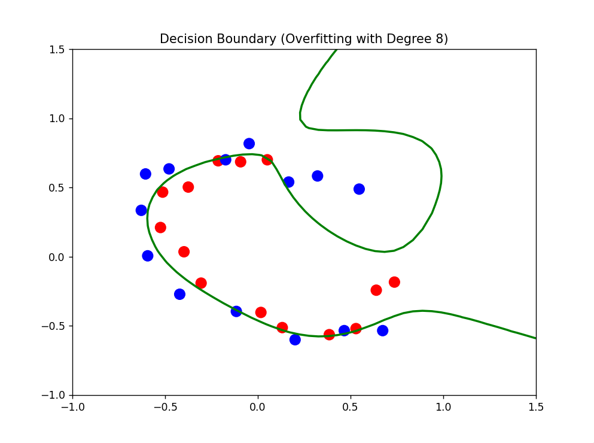
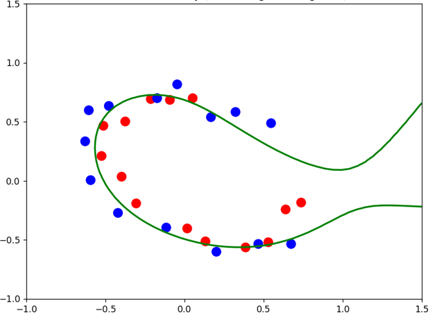
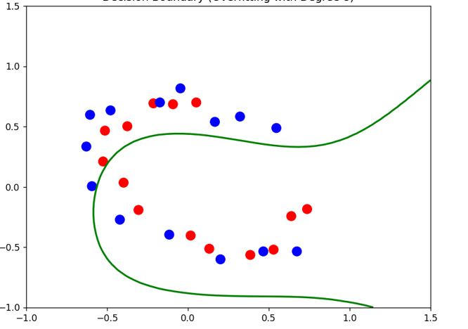

# 🎯 Classification: Logistic Regression from Scratch

This folder contains implementations of **Logistic Regression**, a fundamental classification algorithm. These models are built using purely **NumPy** (no Scikit-Learn) to demonstrate the mechanics of binary classification, probability mapping, and overfitting prevention.

## 🧠 Key Mathematical Concepts

### 1. The Sigmoid Function (Activation)
Unlike linear regression, logistic regression uses the **Sigmoid Function** to map any real-valued number into a probability range between 0 and 1:
$$g(z) = \frac{1}{1+e^{-z}}$$
A prediction is made as $\hat{y} = 1$ when $g(z) \ge 0.5$ (which occurs when $z \ge 0$).

### 2. Logistic Loss (Binary Cross-Entropy)
We use the **Log Loss** function to penalize incorrect predictions. This ensures that the cost increases significantly when the model is confident but wrong:
$$J(w,b) = - \frac{1}{m} \sum_{i=1}^{m} [y^{(i)}\log(f_{w,b}(x^{(i)})) + (1 - y^{(i)})\log(1 - f_{w,b}(x^{(i)}))]$$

### 3. Regularization ($\lambda$)
To prevent **Overfitting (High Variance)**, we apply L2 Regularization. This adds a penalty term to the cost function, discouraging the weights $w$ from becoming too large and making the decision boundary "wiggly".

---

## 📁 File Descriptions

* **`logistic_regression.py`**: The standard implementation for binary classification on linearly separable data.
* **`logistic_regression_regularized.py`**: An advanced implementation for **non-linear data**.
    * Includes **Polynomial Feature Mapping** (maps features $x_1, x_2$ up to degree 8) to create complex decision boundaries.
    * Implements **Regularized Gradient Descent** to tune the Bias-Variance tradeoff.

---

## 🧪 Experiment: The Bias-Variance Tradeoff
I tested the Regularized model on a complex "Microchip" dataset using **8th-degree polynomial features** to observe the effects of the regularization parameter $\lambda$.

### 1. Overfitting ($\lambda = 0$)
* **Training Accuracy:** ~92.86%
* **Observation:** The model memorizes noise, creating "wiggly" boundaries and loops. It has **High Variance**.
* 

### 2. Just Right ($\lambda = 0.01$)
* **Training Accuracy:** ~78.75%
* **Observation:** The model ignores outliers and captures the true "C" shape of the data. This is the **Optimal Fit**.
* 

### 3. Underfitting ($\lambda = 1$)
* **Training Accuracy:** ~60.71%
* **Observation:** The regularization penalty is too high, preventing the model from learning the curve. It has **High Bias**.
* 

---

## 💻 Requirements
* Python 3.x
* NumPy
* Matplotlib
